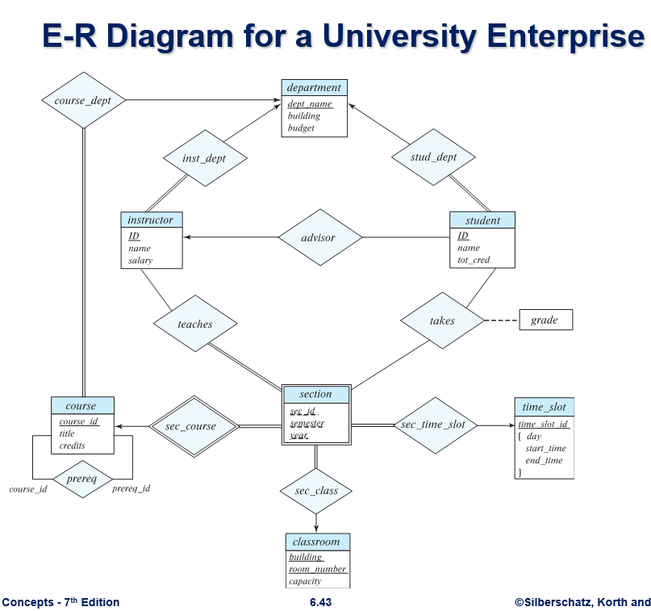

# School Database System

The School Database System is a comprehensive software solution designed to 
manage various aspects of school administration, including student information, courses, teachers, and more. This README provides an overview of the system, its features, setup instructions, and licensing information.

Here is the E-R diagram for the University Enterprise. This Spring JPA project is
based on this architecture:


## Features

- **Student Management**: Easily maintain student records, including personal information, enrollment details, grades, and attendance.
- **Course Management**: Manage course offerings, class schedules, curriculum, and academic requirements.
- **Teacher Management**: Keep track of teaching staff, their qualifications, teaching assignments, and performance evaluations.
- **Administrative Tools**: Access administrative functions for user management, system configuration, and data backup.
- **Reporting and Analytics**: Generate comprehensive reports on student performance, class attendance, teacher workload, and more.

#### Database

- Install MySQL.

#### Programming Language

- Java
- Spring Framework

### Installation

1. Clone the repository:
   ```bash
   git clone https://github.com/yourusername/school-database-system.git
